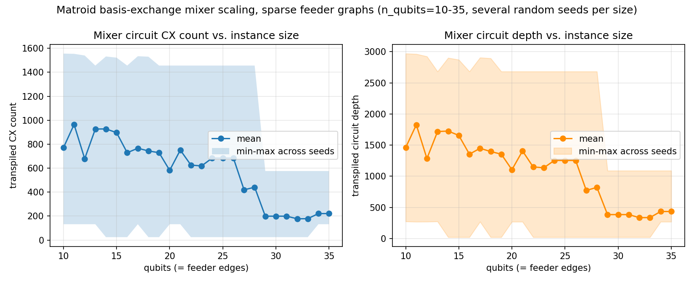
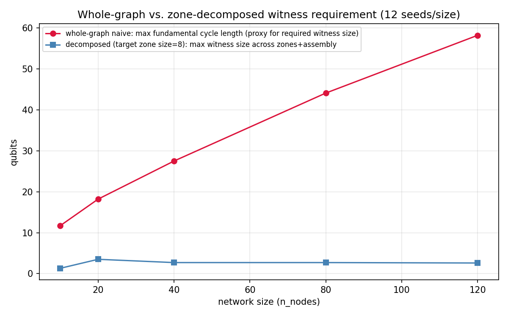
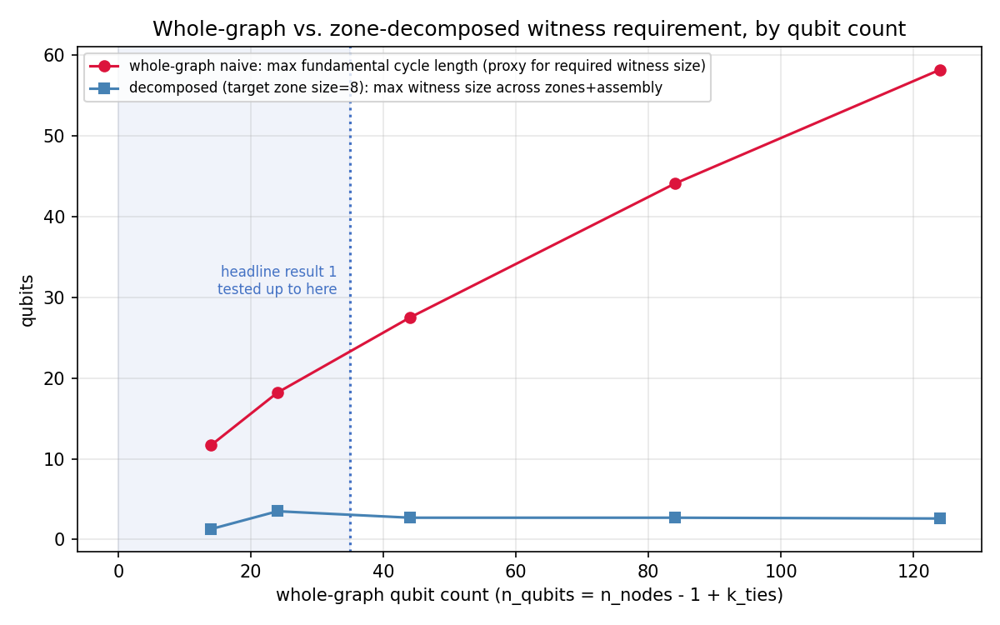

# Matroid basis-exchange QAOA mixer: scaling study

**Question**: for the constraint "the selected edges form a spanning tree
of the graph" (a basis of its graphic matroid), does a QAOA mixer that
preserves that constraint exactly — rather than enforcing it with a penalty
term in the cost function — compile into a circuit whose gate count and
depth scale favorably with graph size, for sparse graphs resembling real
distribution feeders? This is narrower than general worst-case graphs,
where basis-exchange move sets can blow up exponentially; it is the graph
class relevant to feeder reconfiguration, where the network is sparse
(a radial backbone plus a small number of tie switches) and close to
planar. A constraint-preserving mixer restricts QAOA's search to the
feasible subspace directly, instead of relying on a penalty coefficient
in the cost Hamiltonian to discourage infeasible states — trading a
larger, structured mixer circuit for a smaller effective search space and
no penalty-weight tuning. This repo answers whether that trade is cheap
enough, empirically, to be worth making for this problem class.

**Answer, from what's measured here**: yes, on a synthetic sparse-feeder
family — and, once decomposed into zones, also on the real, published
IEEE 33-bus test feeder, with the decomposition's benefit confirmed to
hold as network size grows. Getting there also surfaced and fixed real
problems along the way — a correctness bug, a real-topology scaling
failure, and a circuit-cost inefficiency — rather than finding a clean
result on the first try; how they were found and fixed is part of the
evidence, covered below and in full in `docs/circuit-validity.md`.

## Background: what "feasible" means here

A distribution feeder has more switchable connections than it strictly
needs to reach every load: a normally-closed backbone plus a small number
of normally-open "tie" switches, held open in everyday operation and
closed only temporarily (e.g. to reroute power around a fault). The
network must stay **radial** — every node reached, no loops — for
protection and fault-isolation reasons.


Encoded directly: qubit `i` = 1 iff switch `i` is closed. A configuration
is feasible iff its closed-switch set is a spanning tree of the network
graph — exactly a basis of the network's graphic matroid, shown above on
a small example graph (14 nodes, one candidate tie switch, reused as the
running example in the figures below). This repo studies whether a QAOA
mixer that only ever proposes moves between one spanning tree and
another — never touching an infeasible configuration — compiles into a
circuit that scales well with network size, as an alternative to
enforcing the same constraint with a penalty term in the cost function.

## What we're measuring, and why

A QAOA mixer's job is to move probability between states without ever
leaving the feasible set. Concretely here, that means one operation
repeated many times: **a basis exchange** — close one switch, open
another, land on a different feasible tree.


Matroid theory guarantees moves like this, applied one at a time, are
enough to reach any feasible configuration from any other — so the
*entire* mixer is built from a set of these exchanges, one small circuit
term per move. That would be a trivial circuit-design problem if any
switch pair could be exchanged freely — but it can't: the "Background"
example above already showed that closing a switch without also opening
the right one produces a loop, not another tree. Which switch has to open
depends on the rest of the network's *current* configuration, not just
the two switches being touched, so each exchange's circuit term generally
has to be **conditioned** on other qubits to fire only when the move is
actually valid — never on the states where it would produce a loop.

**This is the actual question this repo measures**: how much does that
conditioning cost, in gates and circuit depth, and does that cost grow or
stay manageable as the network gets larger? A mixer whose per-move
conditioning cost explodes with network size is a mixer that doesn't
scale, independent of anything else about QAOA.

**Why this matters beyond this repo**: keeping that cost bounded, rather
than exploding, is what would let QAOA run at the network sizes where
quantum computing could eventually offer an advantage over classical
methods on constrained problems like this one. Classical formulations of
the same radiality requirement still have to encode it explicitly — as
penalty terms in an objective, or as constraints a solver enforces —
while a constraint-preserving mixer builds feasibility directly into the
algorithm's dynamics instead, a structurally different way of handling
the same requirement that this repo tests for cost, not yet for solution
quality. That's the promise a bounded-cost result is a *precondition*
for, not proof of — see "What this does and doesn't demonstrate" below
for the boundary between the two.

What follows tests the cost question directly — first on a synthetic
sparse-feeder family, no decomposition involved (Headline result 1), then
stress-tested against real, published topology, where the same
undecomposed approach breaks and decomposition turns out to be the fix
(Headline result 2).

## Scope

This repo contains the measurement methodology and results for this one
question only. It does **not** include a production mixer-compilation
library, does not cover other constraint classes, and does not include
hardware execution, QAOA solution quality, or a classical baseline
comparison — see `methodology.md` for the precise boundary of what was
measured, and "What this does and doesn't demonstrate" below for how that
boundary matters when citing this work.

## How to reproduce

```
python -m venv .venv
source .venv/bin/activate   # or .venv\Scripts\activate on Windows
pip install -r requirements.txt

python scripts/verify_correctness.py                  # exact correctness check (small instances)
python scripts/run_scaling_study.py                    # synthetic sweep -> results/scaling_*.{csv,png}
python scripts/run_real_feeder_validation.py            # real IEEE 33-bus graph, whole-graph construction (fails)
python scripts/run_zone_decomposition_validation.py     # zone-decomposition fix, real IEEE 33-bus graph
python scripts/run_decomposition_scaling_study.py       # does the fix hold as network size grows? (synthetic)
python scripts/plot_decomposition_by_qubits.py          # re-plots the above by qubit count, not node count
python scripts/plot_illustrations.py                    # explanatory diagrams (not measurements)
```

All scripts are deterministic (fixed random seeds); re-running should
reproduce the committed files in `results/` exactly, modulo `qiskit`/
`networkx` version differences in transpilation.

## Headline result 1: synthetic scaling sweep

The most basic version of the cost question above, first: build the
mixer directly on a synthetic sparse-feeder family across a growing range
of sizes, and measure the transpiled circuit's CX count and depth at each
size.



Measured across 26 instance sizes (`n_qubits` 10–35) and 5 random graph
seeds per size — `results/scaling_results.csv` (per run) /
`scaling_summary.csv` (per-size mean/min/max). **Takeaway**: within this
range, on this synthetic sparse-feeder graph family, mixer circuit cost
does not grow with instance size — mean and worst-case CX count and depth
trend flat-to-*decreasing*. Not extrapolated past `n_qubits=35`.

**Why cost decreases, not just stays flat**: the number of tie switches
(`k_ties`) is held fixed as the network grows, so the graph gets sparser
as `n_nodes` increases — each tie switch's local neighborhood has fewer
alternative ways to reconnect around it as there's more network to spread
the same few tie switches across. That shows up directly in the per-seed
data: at the smallest tested size (`n_qubits=10`), 3 of 5 random seeds
needed an exchange conditioned on 2 other switches — the most expensive
case in this sweep, up to 1,556 CX; at the largest (`n_qubits=35`), only
1 of 5 did, topping out at 576 CX. Larger, sparser instances have both
fewer exchanges that need conditioning at all, and less conditioning
where it's still needed — see `results/scaling_results.csv` for the full
per-seed breakdown.

## Headline result 2: real topology needs decomposition, but then it works — and keeps working as the network grows

**The real data**: the IEEE 33-bus distribution test feeder (Baran & Wu,
1989) — `n_nodes=33` (buses), `n_qubits=37` (candidate switches: 32
normally-closed + 5 normally-open tie switches), loaded via
`pandapower.networks.case33bw`
([pandapower documentation](https://pandapower.readthedocs.io/en/latest/networks/power_system_test_cases.html)).
Small by qubit-count standards, but real, published topology rather than
another synthetic instance — that's what makes it a meaningful stress
test of headline result 1's approach, not its size. **Only one real
instance exists at one fixed size** — every result below marked
"(synthetic)" uses a generator built to reproduce the real failure mode
at controllable sizes, since there's no way to sweep network size with a
single real data point; results marked "(real data)" are measured
directly on the actual 33-bus graph.

Headline result 1 succeeded on a synthetic graph family whose tie edges
are, by construction, the *geometrically nearest* candidate pairs — short
fundamental cycles, by design. Real published feeders aren't necessarily
built that way: tie switches exist specifically to link distant parts of
a network for reconfiguration redundancy. Does the same whole-graph
construction that just worked still hold up on real, published topology?


*(synthetic — illustrative example, not the 33-bus graph itself)* the
same running example graph from "Background" above, but with the tie
switch choice changed from nearest-neighbor to long-range (same node
positions, `scripts/plot_illustrations.py`). Why that's a problem, made
concrete: recall from "What we're measuring" that an exchange's circuit
term generally has to be conditioned on other qubits, since firing on the
wrong tree configuration produces a loop. The specific qubits it depends
on are exactly the *other* tree edges on its tie switch's fundamental
cycle — call this set of qubits the exchange's **witness**; conditioning
the circuit term on them (instead of firing unconditionally) is what
keeps every firing safe. A short cycle means a small witness — 2 qubits
on the left panel above. A long cycle means a large one — 8 qubits on the
right, in this small example. Since real tie switches are deliberately
long-range (redundancy across distant parts of a network, not between
adjacent switches), the graphs this construction actually has to handle
on real data look like the right panel, not the left.

**It doesn't hold up (real data).** Built directly on the real, published
IEEE 33-bus feeder (Baran & Wu 1989, `n_nodes=33`, `n_qubits=37`) the same
way as headline result 1 — no decomposition, whole graph — 91% of
candidate exchanges have no witness of *any* practical size, and the
resulting mixer is not fully connected: a real completeness gap, not a
performance number (`results/real_feeder_results.csv`). This isn't a
search cap being too small either — the witness the whole graph would
actually need spans dozens of qubits (measured directly,
`docs/circuit-validity.md`), so a bigger cap doesn't fix it. A different
construction does.

**The fix: don't build one circuit for the whole network.** Partition
into zones via a min tie-line-cut, solve each zone's matroid mixer
independently (small qubit count each), plus one small assembly mixer
over the contracted zone graph — a standard partition/assembly strategy,
not a new invention, guaranteed exact by graphic-matroid
contraction/deletion (the union of every zone's spanning tree plus the
assembly problem's spanning tree is provably a spanning tree of the whole
graph). It's the natural fix specifically *because* the failure above is
local to individual long-range ties: keep each zone small enough that any
tie edge still inside it stays short-range-like, and push the genuinely
long-range connections out to one small assembly problem instead of
forcing the whole graph to absorb their cost.


*(synthetic — illustrative example, 24 nodes, not the 33-bus graph)*

**Validated end-to-end on real data.** Real construction, exact per-term
leakage verification, transpiled gate counts, at 4 partition
granularities on the actual 33-bus graph (`n_nodes=33`, `n_qubits=37`) —
every zone and assembly subproblem is exactly leak-free with witness size
0-4, versus 22-34 on the whole graph (`results/zone_decomposition_results.csv`).



*(synthetic sweep — this is not the 33-bus graph either; that fixed
`n_nodes=33` single point can't produce a "vs. network size" curve by
itself)* this isn't a one-instance coincidence though: on a synthetic
family reproducing the real failure mode at controllable size (12
seeds/size, `n_nodes` 10-120), the whole-graph requirement grows roughly
linearly while the decomposed requirement (fixed zone size) stays flat
around 3 — the divergence above is the headline claim of this repo.

**In the same units as headline result 1**, so the two are directly
comparable: the plot above is by `n_nodes`, but headline result 1 was
measured in qubits. Re-plotting the *same synthetic sweep data* above by
qubit count (`n_qubits = n_nodes - 1 + k_ties`, an exact conversion, not
a new measurement, and still not the 33-bus graph):



Headline result 1 only tested up to `n_qubits=35` (shaded band) — within
that range alone, the whole-graph and decomposed requirements haven't
even visibly diverged yet. The real point of this second sweep is that it
extends *far* past where headline result 1 stopped (up to `n_qubits=124`)
without decomposition losing the flat line it started with: the same
small-witness regime headline result 1 already validated keeps holding,
just via a different mechanism (fixed zone size) once the whole graph
itself would have grown out of it.

**Full account, including what didn't smooth over**: the real-topology
failure and its root cause, a first attempted fix that turned out
insufficient, the decomposition fix and its validation, the scaling
sweep, a follow-up finding that circuit cost (unlike witness size) didn't
initially show a clean trend, and the logic-minimization fix that
followed from investigating why — all in `docs/circuit-validity.md`, in
the order it was actually found. `docs/mixer-construction.md` is the
standalone technical reference (matroid theory, exact circuit derivation,
verification arguments) if you want the mechanism independent of the
narrative.

## What this does and doesn't demonstrate

This repo shows the mixer **construction** is correct and scales — both
on synthetic data and, via decomposition, on real topology. It does
**not** show a quantum algorithm outperforming a classical baseline:
there is no cost-Hamiltonian/oracle integration, no QAOA execution, no
classical solver comparison, and no test of the iterative boundary
coupling (an ADMM-style loop) this kind of decomposition would need for
the actual optimization objective — only the radiality constraint,
tested here, decomposes exactly. Treat this as evidence the algorithm is buildable and
scalable, a precondition for an advantage claim, not the claim itself.

## A correctness bug found and fixed during this study

An early version of the mixer circuit was **wrong**: an unconditional
swap gate leaked probability outside the feasible subspace on roughly
half the instances tested, caught by direct verification against the
exact circuit unitary rather than assumed safe. The fix — witness-qubit
conditioning, found by direct search — is in `docs/circuit-validity.md`.
`scripts/verify_correctness.py` re-runs this check independently of the
scaling measurements.

## Repository layout

- `methodology.md` — graph generation, move generation, and exactly what
  "gate count" and "depth" mean.
- `docs/mixer-construction.md` — technical reference: matroid theory,
  move generation, exact circuit-level derivation, witness conditioning
  and its logic-minimization, correctness-verification arguments.
- `docs/circuit-validity.md` — the full narrative: the correctness bug,
  the real-topology failure and its root cause, the decomposition fix and
  its scaling validation, and the circuit-cost investigation.
- `scripts/` — synthetic sweep: `graphs.py`, `mixer.py`, `measure.py`,
  `run_scaling_study.py`, `plot.py`, `verify_correctness.py`. Real
  topology: `real_feeders.py`, `run_real_feeder_validation.py`,
  `investigate_fundamental_cycles.py` (root-cause diagnostic).
  Decomposition fix: `zone_decomposition.py`,
  `run_zone_decomposition_validation.py`,
  `run_decomposition_scaling_study.py` (does it hold as size grows?);
  `plot_decomposition_by_qubits.py` re-plots that sweep's results by
  qubit count instead of node count, for direct comparison against
  headline result 1 (reads the existing CSV, no re-measurement).
  `plot_illustrations.py` generates the explanatory diagrams (not
  measurements).
- `results/` — one CSV/plot pair per script above, all generated, none
  hand-edited; `*_before_minimization.*` files are the pre-fix numbers,
  kept for the before/after comparison in `docs/circuit-validity.md`;
  `illustration_*.png` are the explanatory diagrams
  (`illustration_feeder_problem.png`, `illustration_basis_exchange_move.png`,
  and `illustration_fundamental_cycle.png` share the exact same 14-node
  running example graph; `illustration_decomposition.png` uses a larger
  instance from the same random seed, needed for partitioning to be
  illustrative at all).

## License

Apache License 2.0 — see `LICENSE`.
