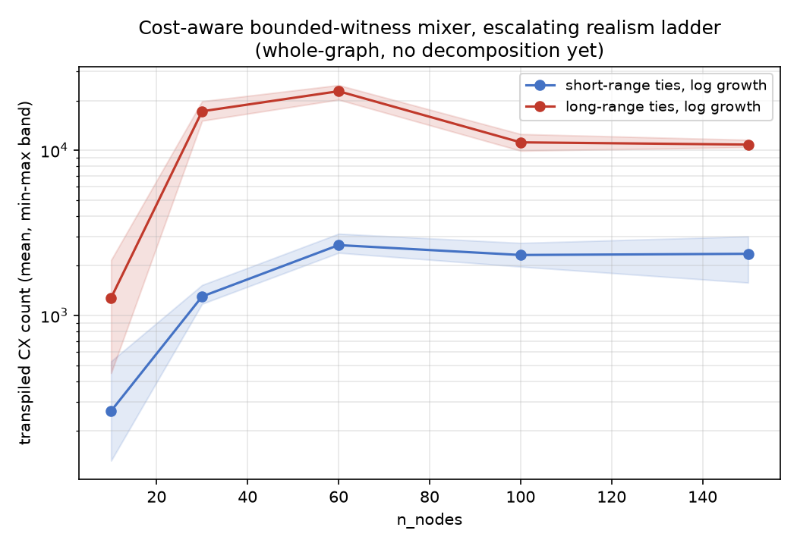
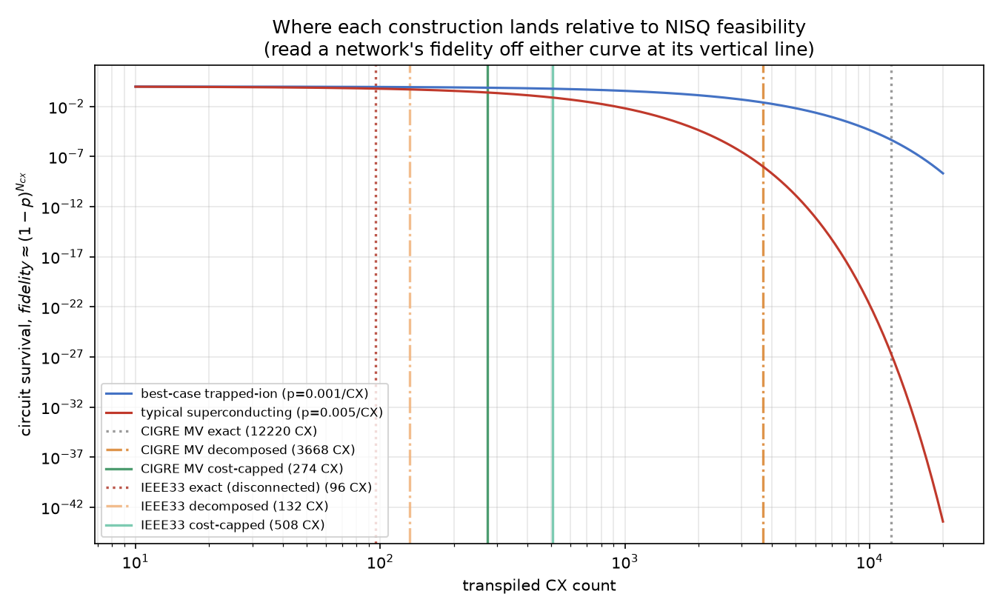

# Matroid basis-exchange QAOA mixer: scaling study

## The question

For the constraint "the selected edges form a spanning tree of the graph"
(a basis of its graphic matroid), does a QAOA mixer that preserves that
constraint exactly — rather than enforcing it with a penalty term in the
cost function — compile into a circuit whose gate count and depth scale
favorably with graph size, for sparse graphs resembling real distribution
feeders? And if the direct answer turns out to be "not on real topology,
not without help": can something be built that still solves the problem
exactly, cheaply enough to matter on both fault-tolerant and near-term
(NISQ) hardware?

This is narrower than general worst-case graphs, where basis-exchange
move sets can blow up exponentially; it is the graph class relevant to
feeder reconfiguration, where the network is sparse (a radial backbone
plus a small number of tie switches) and close to planar. A
constraint-preserving mixer restricts QAOA's search to the feasible
subspace directly, instead of relying on a penalty coefficient in the
cost Hamiltonian to discourage infeasible states — trading a larger,
structured mixer circuit for a smaller effective search space and no
penalty-weight tuning. This repo answers whether that trade is cheap
enough, empirically, to be worth making for this problem class.

**Short answer**: not for free. The direct construction works cleanly on
a synthetic sparse-feeder family, but fails outright on real, published
topology (the IEEE 33-bus feeder) — genuinely infeasible witness sizes,
not a tunable search limit. Two things fix it: **zone decomposition**
(splits the constraint into small, exactly-solvable pieces, provably
lossless) and a **cost-aware bounded-witness mixer** (bounds circuit cost
directly, at a small, measured leakage cost). Together they produce two
things, not one: an **exact** construction, already sufficient for a
fault-tolerant device that doesn't need to care about gate count, and,
via decomposition and a further cost-capped refinement, a **NISQ-plausible**
construction with small, measured (non-zero) leakage — both validated
directly on two real networks, not just synthetic proxies, though which
specific combination gets a given real network into NISQ range varies
network to network (see "Results" below).

## The strategy, at a glance

1. **Establish the baseline** on synthetic data: does the exact
   construction scale at all, under the simplest realistic assumptions?
   (technique 1, below.)
2. **Stress-test it against real topology.** It breaks — trace *why*
   before reaching for a fix.
3. **Fix it two independent ways**, each solving a different piece of the
   problem: zone decomposition (splits the *constraint*, exact) and a
   bounded-witness mixer (bounds *cost* directly, approximate but
   measured). Combine them.
4. **Stress-test the fix** under an escalating ladder of more realistic
   assumptions (tie placement, tie-count growth) calibrated to, and later
   checked against, real feeder data.
5. **Push cost down further** once the fix works, specifically to reach
   NISQ-plausible gate counts, not just "scales better than before."
6. **Validate the whole thing directly on real networks** — not only the
   synthetic families every earlier step was calibrated to.

Each numbered step below links to the full technical account in `docs/`;
this document is the narrative and the numbers that matter for deciding
whether to trust the result, not the complete derivation.

## Background: what "feasible" means here, and why some ties are worse than others

A distribution feeder has more switchable connections than it strictly
needs to reach every load: a normally-closed backbone plus a small number
of normally-open **tie** switches, held open in everyday operation and
closed only temporarily (e.g. to reroute power around a fault). The
network must stay **radial** — every node reached, no loops — for
protection and fault-isolation reasons.


Encoded directly: qubit `i` = 1 iff switch `i` is closed. A configuration
is feasible iff its closed-switch set is a spanning tree of the network
graph — exactly a basis of the network's graphic matroid, shown above on
a small example graph (14 nodes, one candidate tie switch, reused as the
running example in the figures below).

A QAOA mixer's job is to move probability between states without ever
leaving the feasible set. Concretely here, that means one operation
repeated many times: **a basis exchange** — close one switch, open
another, land on a different feasible tree.


Matroid theory guarantees moves like this, applied one at a time, are
enough to reach any feasible configuration from any other — so the
*entire* mixer is built from a set of these exchanges, one small circuit
term per move. That would be a trivial circuit-design problem if any
switch pair could be exchanged freely — but it can't: closing a switch
without also opening the right one produces a loop, not another tree.
Which switch has to open depends on the rest of the network's *current*
configuration, not just the two switches being touched, so each
exchange's circuit term generally has to be **conditioned** on other
qubits to fire only when the move is actually valid.

The qubits an exchange's term depends on are exactly the *other* tree
edges on its tie switch's **fundamental cycle** — call this set of qubits
the exchange's **witness**. A short cycle means a small witness; a long
one means a large witness, and a large witness means an expensive,
deeply-controlled gate.


*(synthetic — illustrative, same running example graph, tie switch choice
changed from nearest-neighbor to long-range, `scripts/plot_illustrations.py`)*
2 witness qubits on the left, 8 on the right, in this small example. Real
tie switches are deliberately placed to link *distant* parts of a network
for redundancy — closer to the right panel than the left — which is
exactly what makes this problem harder on real topology than it looks on
a graph where ties happen to be short-range.

**This is the actual question this repo measures**: how much does that
conditioning cost, in gates and circuit depth, and does that cost grow or
stay manageable as the network gets larger and as tie placement gets more
realistic? A mixer whose per-move conditioning cost explodes is a mixer
that doesn't scale, independent of anything else about QAOA.

**Why this matters beyond this repo**: keeping that cost bounded is what
would let QAOA run at network sizes where quantum computing could
eventually offer an advantage over classical methods on constrained
problems like this one. Classical formulations of the same radiality
requirement still have to encode it explicitly — as penalty terms in an
objective, or as constraints a solver enforces — while a
constraint-preserving mixer builds feasibility directly into the
algorithm's dynamics instead. That's the promise a bounded-cost result is
a *precondition* for, not proof of — see "What this does and doesn't
demonstrate" below for the boundary between the two.

## Techniques used, and what problem each one solves

In the order they're needed to understand the results, not the order
they were built (the build order — including two real detours — is in
"Headline result 4" of `docs/scaling-ladder-and-decomposition.md`, kept
there as part of the evidence, not hidden here).

**1. Exact matroid mixer (`mixer.py`, `build_matroid_mixer`).** For each
candidate exchange, brute-force search for the smallest witness that
makes the term's firing rule exactly correct (no leakage outside the
feasible set, verified against the true validity function, not assumed).
Cheap and exact when witnesses stay small — which they do on a synthetic
family where ties are short-range by construction, but not in general:
**tie range** (long fundamental cycles) and, independently, **tie
density** (many ties even at short range) both push true minimal witness
sizes past any practical search cap, on real topology and on a
density-focused synthetic family respectively (`docs/bounded-witness-mixer.md`'s
Finding 1). When that happens, the exact construction doesn't get
gradually more expensive — it gives up on candidates outright
(`dropped_candidates` climbs to 51-95%) and the resulting mixer stops
being fully connected. Full derivation, the real-topology failure's
root-cause trace, and the exact circuit-level construction:
`docs/circuit-validity.md` and `docs/mixer-construction.md`.

**2. Bounded-witness mixer (`truncated_mixer.py`) — bounds *cost*
directly, at a measured, small leakage cost.** When no small *exact*
witness exists, don't drop the candidate exchange: search for a witness
of a fixed, capped size instead, using a **majority-vote** validity rule
over that smaller set of qubits, and accept the resulting leakage —
provided it's measured, not assumed, and stays small. `leakage_trace.py`
traces the actual probability mass this costs on real trajectories
(exactly, not sampled), separately from the abstract leakage rate the
search itself optimizes.


*(concept diagram, not a measurement — a hand-constructed 3-qubit example
chosen to show one clean mismatch, not a real exchange from any graph
elsewhere in this repo)* the exact witness (all 3 qubits) is never wrong;
capping to 1 qubit and taking a majority vote gets the `a=0` group right
unanimously, but state `100` leaks under the `a=1` group's 3-of-4
majority. A wider witness reduces leakage like this but costs more
circuit — which is exactly why this technique cannot be used without its
other half:

**Making that search cost-aware (`cost_alpha`) is not optional.** Picking
witnesses by leakage alone, with no cost penalty, is actively bad: since
adding a witness qubit can only ever weakly *reduce* leakage, an
uncontrolled search has every incentive to walk to the cap every time —
measured at 17,386–32,520 CX gates at just 15-17 qubits, more than a real
37-qubit decomposed feeder circuit. `cost_alpha` adds a cost penalty to
the search objective directly, closing most of that gap, and is this
construction's validated default (`docs/bounded-witness-mixer.md`).

**3. Zone decomposition (`zone_decomposition.py`) — fixes the *range*
failure structurally, exactly.** Don't build one circuit for the whole
network: partition into zones via a min tie-line-cut, solve each zone's
matroid mixer independently (small qubit count each), plus one small
assembly mixer over the contracted zone graph. Guaranteed **exact** by
graphic-matroid contraction/deletion (the union of every zone's spanning
tree plus the assembly problem's spanning tree is provably a spanning
tree of the whole graph) — a structural fix to the *constraint*, not an
approximation.


*(synthetic — illustrative example, 24 nodes)* it works specifically
*because* the range failure is local to individual long-range ties: keep
each zone small enough that any tie edge still inside it stays
short-range-like, and push the genuinely long-range connections out to
one small assembly problem instead of forcing the whole graph to absorb
their cost.

**When the assembly graph itself is still large or dense, recurse.** The
contracted assembly problem above can end up nearly as hard as the
original graph if it's built from too many zones with too many boundary
ties between them. The fix is the same idea applied one level up:
decompose the assembly graph too, scaling `target_zone_size` inversely to
its own measured density rather than a fixed schedule (found, by direct
comparison, to beat both a fixed recursive schedule and naive
zone-shrinking — `docs/scaling-ladder-and-decomposition.md` §8). This is
still zone decomposition, applied recursively — not a separate technique.

**4. Cost-capped decomposition — guarantees a cost target instead of
hoping for one.** Technique 3 (flat or recursive) picks a zone size up
front and hopes the resulting cost is acceptable; it usually is, but
decomposed cost turns out to have much higher seed-to-seed variance than
whole-graph cost (coefficient of variation up to 99% at some sizes —
decomposition trades one big averaging problem for many small independent
ones, and a single "unlucky" zone can dominate a seed's total). The fix:
build each subproblem, transpile it, check its **actual** cost against a
threshold, and recursively re-split anything over it — measure, don't
guess.


Gets **every seed of the synthetic ladder under 500 CX**, and comes within
1.6% of that target on real data (`docs/scaling-ladder-and-decomposition.md` §11).

## Why the ladder is shaped this way, and why log growth

Validating techniques 2-4 once, on one real anchor point, isn't enough to
trust the result generally — so this repo stress-tests them across an
**escalating ladder** of increasingly realistic assumptions, varied along
two axes, both independently calibrated to the one real anchor point this
repo started with (5 ties at the 33-bus feeder):

- **tie placement**: short-range (nearest-tie, the family used in the
  "Background" figures above) vs. long-range (the family the real-feeder
  failure and the bounded-witness safety survey are built on).
- **tie-count growth**: log (`round(1.43*ln(n))`, mild) vs. linear
  (`round(0.1515*n)`, aggressive).

**This choice was checked against real data, not just assumed.** Three
real/real-benchmark networks (CIGRE MV, IEEE 33-bus, and a real German MV
network, `mv_oberrhein`, via `pandapower.networks`), spanning a 12x size
range:

| network | n_bus | n_ties | ties/n_bus |
|---|---|---|---|
| CIGRE MV | 15 | 3 | 0.200 |
| case33bw (IEEE33) | 33 | 5 | 0.152 |
| mv_oberrhein | 179 | 6 | 0.034 |

The ratio drops 6x from smallest to largest — flatly inconsistent with
linear growth (which would keep it roughly constant), reasonably
consistent with log growth (`ties/log(n_bus)` comes out to 1.11, 1.43,
1.16 — much tighter). Real tie *range* was checked the same way: real
ties consistently span 33-45% of network diameter, matching this repo's
long-range generator far better than its short-range one (which gets
*worse*, not better, with scale). **`CONDITIONS` therefore defaults to
the two log-growth conditions**; linear growth is kept as an explicit,
fully reproducible stress test, not deleted, but no longer presented as
equally realistic (`docs/scaling-ladder-and-decomposition.md` §9 has the
full check, including honest caveats — 3 points spanning one order of
magnitude rules out linear but doesn't fit an actual growth law).

## Results: fault-tolerant now, NISQ-ready with decomposition

Techniques 1-2 — exact, or cost-aware bounded-witness, applied directly
to the whole graph, no decomposition involved — already form a complete,
valid construction: correct, or controlled-and-measured leakage, at
whatever circuit cost the search finds. A fault-tolerant device has no
reason to care about that cost the way near-term hardware does, so
techniques 1-2 alone are the fault-tolerant-ready answer. Techniques 3-4
— zone decomposition and its cost-capped refinement — exist for a
narrower, harder goal on top of that: making the same construction cheap
enough to matter on NISQ hardware today, against the rough feasibility
arithmetic below (`fidelity ≈ (1-p)^N_CX`, published two-qubit gate error
rates):

| CX count | best-case trapped-ion (p=0.001) | typical superconducting (p=0.005) |
|---|---|---|
| 100 | 90% | 61% |
| 500 | 61% | 8% |
| 1,000 | 37% | 0.7% |
| 5,000 | 0.7% | ~0 |
| 13,000 | ~10⁻⁶ | ~0 |

### On synthetic data, the two tiers split cleanly

Technique 2 (cost-aware bounded-witness, applied directly, no
decomposition) across the escalating realism ladder:



Cost plateaus by `n_nodes=60` rather than growing further, and the mixer
stays fully connected throughout (`docs/scaling-ladder-and-decomposition.md`
§2) — a complete fault-tolerant-ready construction on its own. But most
of these numbers are already past where the table above turns
unfavorable for NISQ hardware. Decomposition (technique 3) and its
cost-capped refinement (technique 4) close that gap, without exception on
this data: at every size ≥ 30 nodes, every seed, both log-growth
conditions, decomposition costs less than the whole-graph construction
alone (5.6x-46.7x cheaper — `docs/scaling-ladder-and-decomposition.md`
§6-8), and cost-capped decomposition guarantees the rest of the way:
every seed, both conditions, all five sizes tested, lands under 500 CX.


On synthetic data: more decomposition, less cost, no exceptions.

### On real data, the picture is less clean — but both networks land in NISQ range either way


| network | construction | CX | reading |
|---|---|---|---|
| CIGRE MV (15 buses, 3 ties) | exact whole-graph | 12,220 | fault-tolerant-ready; far outside NISQ range |
| CIGRE MV | decomposed | 3,668 | cheaper, but still outside a comfortable NISQ regime |
| CIGRE MV | cost-capped decomposed | **274** | comfortably NISQ-ready |
| IEEE33 (33 buses, 5 ties) | exact whole-graph | 96 | 573/597 candidates dropped, disconnected — not usable at any cost |
| IEEE33 | decomposed | **132** | already comfortably NISQ-ready, directly |
| IEEE33 | cost-capped decomposed | 508 | more expensive than plain decomposition, not less |

The synthetic story's monotonic "more decomposition, less cost" doesn't
repeat here. On CIGRE MV, cost-capping is what actually earns
NISQ-readiness — decomposition alone isn't enough. On IEEE33, plain
decomposition already lands comfortably in NISQ range, and cost-capping's
extra splitting *raises* the total instead of lowering it. Which specific
combination is best is real-network-dependent, not a fixed recipe — but
whichever one applies, both real networks end up tackled at a
NISQ-plausible cost: IEEE33 directly by decomposition, CIGRE MV by its
cost-capped refinement.



**Full account**: `docs/scaling-ladder-and-decomposition.md`.
`docs/bounded-witness-mixer.md` covers the density-failure axis, the
bounded-witness construction itself, and the cost-aware search in full
detail.

## What this does and doesn't demonstrate

This repo shows the mixer **construction** is correct and scales — both
exactly (fault-tolerant-relevant) and, via decomposition and cost-capping,
cheaply enough for a plausible NISQ target (real-topology-relevant). It
does **not** show a quantum algorithm outperforming a classical baseline:
there is no cost-Hamiltonian/oracle integration, no QAOA execution, no
classical solver comparison, and no test of the iterative boundary
coupling (an ADMM-style loop) this kind of decomposition would need for
the actual optimization objective — only the radiality constraint,
tested here, decomposes exactly. Treat this as evidence the algorithm is
buildable and scalable, a precondition for an advantage claim, not the
claim itself. See `methodology.md` for the precise boundary of what was
measured.

## How to reproduce

Three steps cover everything this README claims:

```
python -m venv .venv
source .venv/bin/activate   # or .venv\Scripts\activate on Windows
pip install -r requirements.txt

python scripts/verify_correctness.py && python scripts/verify_leakage_trace.py
# correctness: the exact construction is exactly leak-free and fully
# connected wherever it applies; the bounded-witness construction's
# leakage tooling (sparse tracer, Wilson's-algorithm sampling) is verified
# against an exact reference.

python scripts/run_real_networks_hierarchical.py
# the real-network numbers the Results section reports: exact vs.
# decomposed vs. cost-capped, both CIGRE MV and IEEE33.

python scripts/plot_results_figures.py && python scripts/plot_illustrations.py
# every figure in this README, regenerated from already-committed data.
```

All scripts are deterministic (fixed random seeds); re-running should
reproduce the committed files in `results/` exactly, modulo `qiskit`/
`networkx` version differences in transpilation.

This reproduces what's *shown* here, not every measurement behind it —
`ladder_cx_plot.png` and `construction_progression_plot.png` read
already-committed CSVs (`results/cost_aware_scaling_ladder_*.csv`,
`decomposed_cost_aware_ladder_*.csv`, `cost_capped_decomposition_*.csv`)
rather than re-deriving them from scratch. To regenerate those (or dig
into the fuller investigation — the escalating realism ladder, the
density-blowup axis, hierarchical decomposition, the real-topology
growth-model check), the complete set of scripts is listed under
`scripts/` in "Repository layout" below, each tied to the section of
`docs/*.md` it backs.

## Scope

This repo contains the measurement methodology and results for the
question above only — not a production mixer-compilation library, and
not extended to constraint classes other than graphic-matroid radiality
(`methodology.md` has the precise boundary). See "What this does and
doesn't demonstrate" above for the separate, more important boundary:
what a bounded-cost, buildable construction does and doesn't imply about
QAOA performance.

## Repository layout

- `methodology.md` — graph generation, move generation, and exactly what
  "gate count" and "depth" mean.
- `docs/mixer-construction.md` — technical reference: matroid theory,
  move generation, exact circuit-level derivation, witness conditioning
  and its logic-minimization, correctness-verification arguments.
- `docs/circuit-validity.md` — the full narrative: the correctness bug,
  the real-topology failure and its root cause, the decomposition fix and
  its scaling validation, and the circuit-cost investigation.
- `docs/bounded-witness-mixer.md` — a second, density-driven witness-blowup
  axis, the bounded-witness mixer as an alternative to decomposition
  (construction, a correctness bug the cross-check caught in shared code,
  real-scale safety survey), and the circuit-cost investigation that
  found the first version of that construction cost up to 38x more than
  necessary, plus the cost-aware search fix that mostly closed the gap.
- `docs/scaling-ladder-and-decomposition.md` — does the flat-tie-count
  assumption hold under a more realistic growth model (no); an
  escalating realism ladder for the bounded-witness mixer and a NISQ
  hardware feasibility check; a real bug (silent term collapse) found
  while pushing cost down further; a dead end (per-term adaptive cost
  pressure) that looked like a fix and wasn't, caught by re-validation;
  the fix that actually works (decomposition + the bounded-witness
  mixer, dominating almost everywhere it applies) -- including a SECOND
  instance of the same adaptive-search bug found inside the
  decomposition script itself; density-aware hierarchical decomposition,
  pushing the hardest remaining conditions further toward NISQ
  feasibility; a real-topology check validating log-growth/long-range
  tie modeling against real (and real-benchmark) feeder data, after
  which linear tie-count growth moved from a default condition to an
  explicit stress test; direct validation of the actual construction on
  two real networks; cost-capped decomposition (measures each
  subproblem's actual cost and recursively re-splits anything over a
  threshold, guaranteeing every synthetic-ladder seed stays under 500
  CX, and coming within 1.6% of that target on real data); and two
  methodology mistakes this investigation made and caught (comparing
  results across a code fix without re-running both sides, twice).
- `scripts/` — synthetic sweep: `graphs.py`, `mixer.py`, `measure.py`,
  `run_scaling_study.py`, `plot.py`, `verify_correctness.py`. Real
  topology: `real_feeders.py`, `run_real_feeder_validation.py`,
  `investigate_fundamental_cycles.py` (root-cause diagnostic).
  Decomposition fix: `zone_decomposition.py`,
  `run_zone_decomposition_validation.py`,
  `run_decomposition_scaling_study.py` (does it hold as size grows?);
  `plot_decomposition_by_qubits.py` re-plots that sweep's results by
  qubit count instead of node count, for direct comparison against the
  synthetic scaling sweep (`run_scaling_study.py`, `scaling_plot.png` --
  `docs/circuit-validity.md`'s "headline result 1") (reads the existing
  CSV, no re-measurement).
  `plot_illustrations.py` generates the explanatory diagrams (not
  measurements) -- including `plot_bounded_witness_concept()` and
  `plot_cost_capped_decomposition_concept()`, added alongside this
  README's restructuring to illustrate techniques 2 and 4 directly, since
  neither previously had a diagram of its own. Bounded-witness mixer: `random_trees.py` (Wilson's
  algorithm + exchange-graph-walk sampling), `truncated_mixer.py`
  (bounded-witness construction, including the cost-aware search --
  `cost_alpha` -- described below), `leakage_trace.py` (exact + sparse
  danger-mass tracing), `verify_leakage_trace.py` (correctness check for
  all three), `tie_density_sweep.py` (the density-driven witness-blowup
  axis), `run_bounded_witness_safety_survey.py` (real-scale safety +
  circuit-cost survey). Circuit-cost investigation:
  `measure_truncated_mixer.py` (own cost trend + head-to-head vs. the
  exact construction on the density family), `truncated_witness_cap_sweep.py`
  / `truncated_witness_cap_sweep_longrange.py` (witness-cap vs. cost/safety,
  density family and long-range family + real scale), and
  `truncated_mixer_search_refinement.py` (cap=0/1 instability check, and
  the `cost_alpha` sweep that set the construction's current default).
  Escalating realism ladder + decomposition:
  `run_scaling_study_log_ties.py` (the flat-tie-count assumption,
  stress-tested), `run_cost_aware_scaling_ladder.py` (the four-condition
  ladder), `run_cost_aware_scaling_ladder_aggressive.py` (the never-fire
  collapse, deliberately reproduced with `active_terms` tracked so it's
  visible in the CSV), `run_cost_aware_scaling_ladder_alpha_sweep.py`
  and `truncated_mixer_search_refinement.py`'s adaptive-search addition
  in `truncated_mixer.py` (the adaptive-alpha dead end),
  `run_fixed_alpha_ladder.py` (the fixed-`cost_alpha` baseline,
  re-measured after the never-fire fix so the final comparison is valid),
  `run_decomposed_cost_aware_ladder.py` (the fix that works), and
  `run_best_of_both_ladder.py` (confirms decomposition never loses once
  it can be applied at all). `run_hierarchical_decomposed_ladder.py`
  (density-aware recursive decomposition for the still-hard conditions,
  three iterations each empirically validated),
  `run_real_networks_hierarchical.py` (this branch's actual construction
  run directly on `real_feeders.load_cigre_mv` -- new -- and the
  existing `load_ieee33`), and `run_cost_capped_decomposition.py` (measures
  each subproblem's actual CX cost and recursively re-splits anything over
  a threshold, rather than picking a zone size and hoping -- 100% success
  on the synthetic ladder, tested on both real networks too) round it out.
  `plot_results_figures.py` generates this README's four result figures
  (`ladder_cx_plot.png`, `construction_progression_plot.png`,
  `nisq_feasibility_plot.png`, `real_network_comparison_plot.png`)
  directly from already-committed CSVs -- no re-measurement, same
  discipline as `plot_decomposition_by_qubits.py`.
- `results/` — one CSV/plot pair per script above, all generated, none
  hand-edited; `*_before_minimization.*` files are the pre-fix numbers,
  kept for the before/after comparison in `docs/circuit-validity.md`;
  `illustration_*.png` are the explanatory diagrams
  (`illustration_feeder_problem.png`, `illustration_basis_exchange_move.png`,
  and `illustration_fundamental_cycle.png` share the exact same 14-node
  running example graph; `illustration_decomposition.png` uses a larger
  instance from the same random seed, needed for partitioning to be
  illustrative at all; `illustration_bounded_witness.png` and
  `illustration_cost_capped_decomposition.png` are concept diagrams for
  techniques 2 and 4, not derived from any specific measured instance).

## License

Apache License 2.0 — see `LICENSE`.
