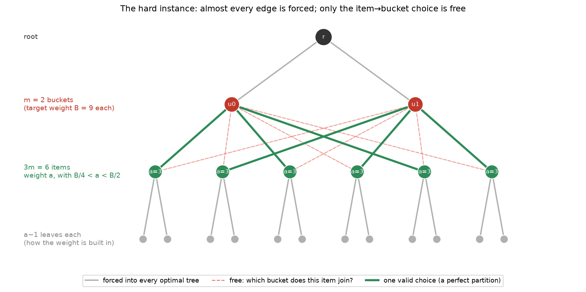
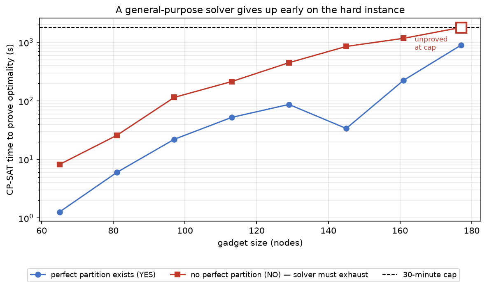
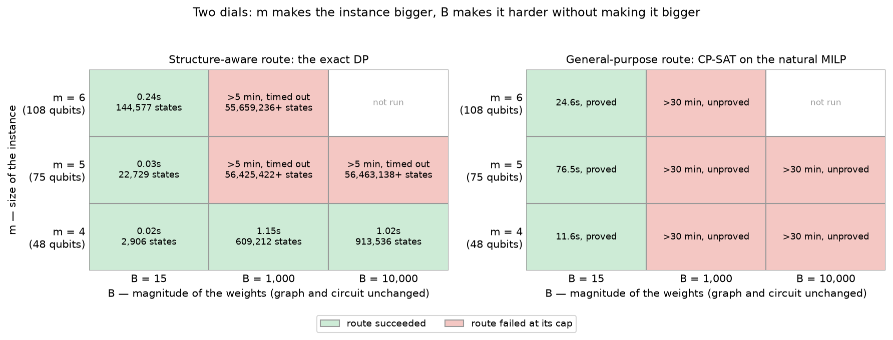
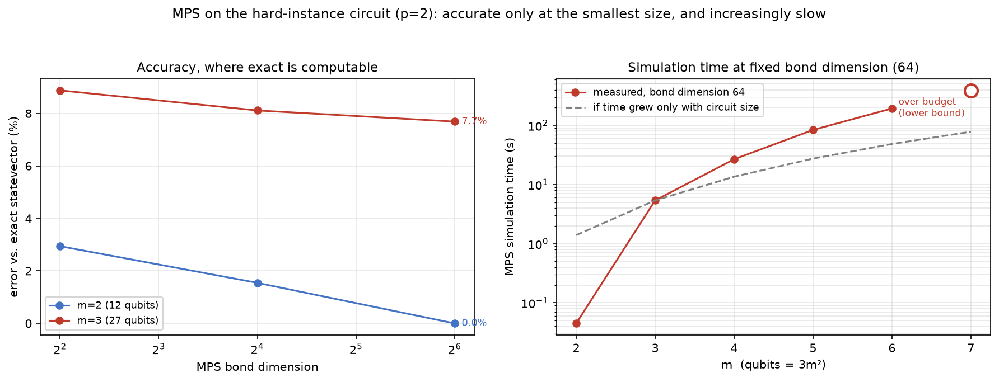

# A feasibility-preserving QAOA mixer for grid reconfiguration — and a provably hard family of the same problem

## Two questions, one problem

Quantum optimization has a feasibility problem. On constrained problems,
QAOA's difficulty usually isn't the objective — it's that most of the
states the algorithm explores aren't even allowed. The usual fix,
penalty terms, spends precious circuit depth punishing infeasible states
instead of searching among feasible ones, and still can't promise the
answer it returns is valid.

The cleaner idea is a **mixer that only ever moves between feasible
states**, so infeasibility never enters the search at all. The
difficulty is building one cheaply enough to run.

This repo does that for one real, practically important constraint:
keeping an electrical distribution network **radial** — every customer
connected, no loops — as switches open and close. And it asks two
questions about it, in order:

1. **Can the mixer be made cheap enough for real hardware?** Yes — at
   two tiers, one for fault-tolerant machines and one that meets a
   500-CX budget on every instance tested, validated on real published
   grids.
2. **Is this problem actually hard enough to need quantum?** For real
   grids, honestly, no — a classical solver walks them. But there is a
   provably hard *family* of the same problem. This repo builds
   instances from it, measures a general-purpose solver giving up on
   them, and shows the circuit for them is small. One caveat — a
   structure-aware classical shortcut exists at small weights — is
   stated where it arises, and closed by a second experiment that turns
   the weights up: there, every classical route tried fails on a
   measured 75-qubit instance whose circuit is no bigger than before.

The second question is the one most quantum-optimization work skips.

## Question 1: can the mixer be made cheap enough for real hardware?

### The problem, and the move that keeps it feasible

A distribution feeder has more switches than it strictly needs: a
normally-closed backbone, plus a handful of normally-open **tie**
switches, closed only to reroute power around a fault. Whatever the
switches do, the network must stay radial.

Each switch is a qubit (1 = closed). A configuration is feasible when
the closed switches form a **spanning tree** — every node reached, no
loops.


The mixer's move is a **basis exchange**: close one switch, open
another, and land on a different tree. Matroid theory guarantees a
chain of such moves can reach any feasible configuration from any other
— so the whole mixer is just one small circuit term per possible
exchange.


**Here is the catch.** *Which* switch has to open depends on the rest
of the current configuration. So each exchange term must be conditioned
on other qubits — specifically, on the loop the closing switch would
create, its **fundamental cycle**. A tie's *range* is how far apart its
two ends sit on the backbone, and that is exactly the length of this
loop. A **short-range** tie closes a small loop and needs a cheap
condition. A **long-range** tie closes a loop that winds across much of
the network, and needs a gate controlled on many qubits — expensive.


Real tie switches are long-range on purpose: they exist to reroute
power around a fault, so they deliberately link *distant* parts of a
feeder. Measured on published topologies, real ties span 33–45% of the
network's diameter. Real topology is the expensive case, and everything
in the next section is about paying that cost down.

### Two ways to make it cheap

**Tier 1 — whole graph, for fault-tolerant hardware.** Build the mixer
on the entire network, but cap how many qubits any single term may
condition on (that set of qubits is the term's **witness**). Where the
cap bites, the term becomes slightly imprecise:
a small, *measured* fraction of probability can leak into infeasible
states. The search that chooses each term's condition has to weigh
circuit cost against that leakage explicitly — letting it minimize
leakage alone drives cost up by orders of magnitude. Done right, this
gives a complete, fully connected mixer at a cost fault-tolerant
hardware can absorb.

**Tier 2 — zones, for today's hardware.** Cut the network into small
zones along its tie lines, build a Tier 1 mixer inside each zone, and
stitch them together with one small mixer over the contracted "zone
graph." The mathematics of spanning trees guarantees the stitched
result is a valid tree, so the decomposition itself cannot leak. Then
enforce a cost budget: transpile each piece, check its real gate count,
and split or retune any piece that comes in over the line.

Two honest limits. Tier 2 searches only trees that stay connected
*inside* every zone — a subset of all feasible configurations, so an
optimum that doesn't respect the zone boundaries is out of reach. And
leakage inside a zone is prevented in practice by keeping zones small,
not by construction. The 500-CX budget is a target the algorithm
recurses toward; the finding is that on every instance tested it got
there without leaking and without ever needing its last-resort
fallback (loosening a zone's leakage cap to buy cost).


*(A third, simpler construction — exact conditioning with no cap — is
the baseline both tiers grow from. It is not a tier: when no small
exact condition exists it silently drops the exchange, and on real
topology that leaves the mixer disconnected. `docs/circuit-validity.md`
traces that failure.)*

### Results

Where the tiers land is judged against a simple yardstick. With
published two-qubit error rates, a circuit's chance of running cleanly
is roughly `(1 − p)^N_CX`; 500 two-qubit gates (CX) is about where
today's hardware stops being viable:

| CX gates | trapped-ion (p=0.001) | superconducting (p=0.005) |
|---|---|---|
| 100 | 90% | 61% |
| 500 | 61% | 8% |
| 5,000 | 0.7% | ~0 |

**Why two kinds of experiment.** Published feeder topologies are scarce
— this repo has two, at 15 and 33 buses. They can show the tiers work
on real structure, but not whether they *keep* working as networks
grow toward realistic sizes. A synthetic ladder can grow, but it only
means something if it is built to resemble real feeders in the ways
that actually drive cost. So the ladder answers *does it scale?*, the
real feeders answer *does it transfer?*, and each is convincing only
because of the other.

**The synthetic ladder** runs from 10 to 150 nodes, three random
feeders per size, matched to real feeders in the two ways that matter:
every tie is long-range, and the number of ties grows only
logarithmically with network size. That second fact comes from real
data — thin data, three published feeders being all that exist at this
scope, but consistent: from 15 to 179 buses the ratio of ties to buses
falls about 6×, which is what logarithmic growth looks like. Larger real grids
don't get proportionally more redundancy, just a little more.


At the largest size (150 nodes, 156 qubits), Tier 1 costs 10,712 CX at
depth ~18,600; Tier 2 costs 337 CX at depth ~650. That is under the
500-CX line, but by the yardstick above it is viable on trapped-ion
hardware and marginal on superconducting. Cost alone isn't the whole
question, though: Tier 1 gets its cost down by capping conditions, so
it has to be asked how much exactness the cap gave up. The answer is
mean leakage of up to 9%, with roughly a third of starting
configurations leaking at all. Tier 2, asked the same question, gave up
nothing on any instance tested. Cheaper *and* exact in practice, not a
tradeoff.

**The real feeders** are the transfer test: topology nobody designed to
be convenient. Both tiers were built on the CIGRE MV benchmark (15
buses, 3 ties) and the IEEE 33-bus feeder (33 buses, 5 ties), five
random seeds each:


Tier 2 lands comfortably inside today's hardware budget on both
networks — 64 CX at depth 147 on 17 qubits, 132 CX at depth 272 on 37
qubits — and its number is identical across every seed: predictable,
not just cheap. Tier 1 stays complete and fully connected on both, at a
cost only fault-tolerant hardware could absorb. But fault tolerance
removes gate error, not leakage, and Tier 1's leakage is permanent: on
IEEE33, 43% of starting configurations leak. There is, in other words,
no exact *and* complete whole-graph construction that works on real
topology — the exact one comes out disconnected, and Tier 1 leaks.

The full account — including the intermediate constructions, the
short-range control condition, and the safety measurements not shown
here — is in `docs/scaling-ladder-and-decomposition.md` and
`docs/bounded-witness-mixer.md`.

## Question 2: is the problem hard enough to need quantum?

### Where hardness has to come from

So the mixer runs, cheaply, on real grids. The obvious next question is
whether a quantum computer was ever needed. For the real grids above —
no. A feeder has only a handful of tie switches, so its set of feasible
configurations is small, and a classical solver simply enumerates it.

The cheapest way to make a real grid harder would be to keep its
topology and make the objective nastier. That was tried first, on the
IEEE 33-bus feeder, with a random quadratic cost and then with a
physically motivated congestion cost. Both were solved to proven
optimality in under a third of a second: with so few feasible
configurations, the objective barely matters.

Hardness, then, has to come from the combinatorics, not the topology.
So this repo takes a published NP-hardness proof for exactly this
problem — radial reconfiguration under a loss-minimizing objective
(Khodabakhsh et al., arXiv:1711.03517) — and builds the instances it
describes.

### The instance, and why its circuit is small

The proof encodes a classic hard problem, 3-PARTITION, as a network: a
root, a few *bucket* nodes, a set of *item* nodes each carrying a
weight, and every item connected to every bucket. Reconfiguring it
optimally is the same as sorting the items into buckets of equal total
weight.

Two numbers fix an instance. **m** is the number of buckets. There are
always 3m items, and the circuit has one qubit per (item, bucket) pair
— 3m² in total — so m sets the instance's *size*. **B** is the target
weight per bucket: every item weighs between B/4 and B/2, so exactly
three fit in each, and the question is whether the items can be split
into m groups weighing exactly B. B sets the *magnitude of the
weights* and nothing else — raising it changes the numbers written on
the items, not the node count and not the qubit count. That
distinction is the whole story of the experiment at the end of this
section.



Tier 1 and Tier 2 can't even be started on this network: both begin by
enumerating the feasible set, and here that set is astronomically
large — which is precisely *why* the instance is hard. The way in is
the hardness proof itself. It shows that almost every edge is forced
into every optimal tree, and the only free choice — which bucket each
item joins — is independent from item to item. Independent choices
need no conditioning, so the mixer needs no witness search at all. The
result: 48 qubits with about 800 two-qubit gates cover a 65-node
instance, and the circuit's size depends only on the number of buckets
and items — not on the weights.

### Results

Two measurements and one argument, each answering an objection a
skeptical reader should raise.

**"A classical solver would just handle it."** The honest measure of
classical hardness is not how fast a solver *finds* a good tree —
heuristics do that quickly on almost anything — but how fast it can
*prove* the tree is optimal.



CP-SAT's proof time grows from a few seconds on a 65-node instance to a
30-minute timeout, proof unfinished, at 177 nodes. Every point is
cross-checked against an independent exact calculation — and that
calculation is the caveat. It is a dynamic program that exploits the
very structure the hardness proof exposes, and at the fixed B=15 used
here it runs in milliseconds. So what fails is a general-purpose
solver on the natural formulation, not every classical route. Genuine
hardness needs B to grow — which inflates every classical route but
leaves the quantum circuit's size untouched, since B changes the
weights and not the qubit count.

So that experiment was run. Weights were drawn at random with B raised
to 1,000 and 10,000, at the same instance sizes, and both classical
routes were given their caps. (For this run the weights are encoded as
nodal demands rather than as leaf nodes — Khodabakhsh's original form,
and how the DP and the circuit already worked — so the graph stays at
1 + m + 3m nodes no matter how large B gets. The graph is not what B
grows.)



Read it by column. At B=15 both routes succeed at every size: the DP
because weights from {4,5,6,7} produce only a few thousand distinct
partial sums, CP-SAT because the instance is small. Raise B and the
columns turn red. CP-SAT fails at *every* size — even m=4, a 17-node
graph, is unproved after 30 minutes — because it is the proof, not the
search, that large weights defeat. The DP survives one row longer: at
m=4 it still finishes in a second, because its work is bounded by the
number of distinct partial sums, which at m=4 tops out near a million.
At m=5 that bound is a quarter of a billion; the DP passed 56 million
states in five minutes and stopped. So the cell that settles it is
m=5, B=1,000: **both classical routes fail, on one measured instance,
at 75 qubits** — and the circuit for it is the B=15 circuit with
different angles.

**Why the circuit doesn't grow with B.** The mixer's encoding is one
small register per item with one qubit per bucket, exactly one of
which is on: *this item sits in that bucket*. Its only move is to slide
that single 1 from one position in a register to another — the item
changes bucket. The gate that does it is the same two-qubit exchange
rotation Question 1's mixer uses, but with none of its conditioning:
it acts only when exactly one of the pair is on and leaves both-off and
both-on states alone, so it can move the 1 but never duplicate or lose
it, and every register keeps exactly one bucket lit by construction
(checked exactly — a register's full set of swaps conserves its number
of on-qubits for every possible input). What the hardness proof
licenses is that this move is *always* legal: an item's leaves follow
it wherever it goes and every bucket is permanently connected to the
root, so any bucket is a valid destination no matter where every other
item sits. That is why no swap needs a witness — no controlled gates,
no search for conditions.

Now count what's left. Qubits: items × buckets. Mixer gates: one swap
per item per pair of buckets. Cost gates: one term per pair of items
per bucket. B appears in none of them. It enters only as the *angles*
dialed into the cost rotations, which are proportional to the item
weights. Raising B from 15 to 10,000 changes the numbers on the dials
and nothing about the circuit's shape — which is what makes B the one
dial the classical routes feel and the quantum circuit does not.

**"A classical computer could just simulate that circuit."** A small
circuit only matters if it can't be shortcut classically. The strongest
general tool for that is a tensor-network simulator (MPS), which stores
the quantum state in compressed form. One knob, the **bond dimension**,
sets how much entanglement the compression can hold: larger is more
faithful and slower. An exact, uncompressed simulation is only possible
up to 27 qubits, so the figure asks two questions — where an exact
answer exists, does MPS agree with it? And beyond that, how fast does
its running time grow?



*Left*: MPS's error against the exact answer, as bond dimension grows.
At 12 qubits the error falls to zero — MPS works. At 27 qubits it
plateaus around 8% and stops improving. *Right*: MPS's running time at
the largest bond dimension tried, as the instance grows, against a
dashed line showing what the time would be if it grew only with the
circuit's gate count. The measured time pulls away from that line —
about 3× above it by m=6 — and exceeds its budget at m=7. The excess
is the price of representing entanglement, not the circuit getting
bigger. So MPS is wrong where it can be checked, and increasingly slow
where it can't. This was one simulator at modest bond dimension,
though; a stronger tensor-network attempt is the obvious next test.

**"Then the two halves of this repo contradict each other."** The hard
instance needed a *simpler* mixer than the real grids did — the
unconditioned swaps just described. That is not a contradiction — it is
the key to how the halves fit. Real grids are
*structurally* hard to stay feasible on — long loops, expensive
conditions — but *combinatorially* easy to solve. The hard family is
the mirror image: structurally trivial, combinatorially hard in
general. Each construction handles the axis its problem actually has.
Whether an instance exists that is hard on both axes at once is an open
question this repo does not answer.

Full account: `docs/hard-instance-case-study.md`.

## What is and isn't shown

Question 1 shows the mixer is correct and cheap enough for both
hardware tiers. It does not show a quantum algorithm beating a
classical one: there is no objective, no QAOA run, and no test of the
boundary-coupling loop a real decomposed optimization would need.

Question 2 adds an objective, a real solver comparison, and a
simulation comparison, and at large weights exhibits an instance on
which every classical route tried fails — but on purpose-built
instances, against two classical routes, and it stops short of
demonstrating advantage. Solution quality at the genuinely hard sizes
is unmeasured, because both classical ways of checking it hit walls
first. The case study says so, with numbers.

Nothing broader is claimed for either. This is a measurement study,
not a production mixer-compilation library; `methodology.md` has the
precise boundary.

## How to reproduce

```
python -m venv .venv
source .venv/bin/activate   # or .venv\Scripts\activate on Windows
pip install -r requirements.txt
```

**Question 1 — the mixer:**

```
python scripts/verify_correctness.py && python scripts/verify_leakage_trace.py
# the exact construction is leak-free where it applies; the Tier 1
# leakage tooling is verified against an exact reference.

python scripts/run_real_networks_hierarchical.py
# the real-network figures above: both tiers, both networks, 5 seeds each.
```

**Question 2 — the hard instance:**

```
python scripts/verify_partition_mixer.py
# exact-unitary proof that the case study's mixer preserves feasibility,
# plus an exact check of its cost Hamiltonian against the true objective.

python scripts/measure_partition_mixer.py
# transpiled gate counts and depth for the 48-qubit hard instance.

python scripts/run_hardness_sweep.py       # CP-SAT hardness curve at B=15 (slow: hours)
python scripts/run_mps_scaling_check.py    # the MPS comparison (~15 min)
python scripts/run_large_b_sweep.py        # the two-dials grid, DP + CP-SAT (slow: ~5 hours)
python scripts/run_large_b_dp_states.py    # DP state counts for the grid (~25 min)
```

**Every figure in this README**, both questions, from already-committed
data:

```
python scripts/plot_results_figures.py && python scripts/plot_illustrations.py
```

The circuit-construction scripts are deterministic (fixed seeds) and
reproduce the committed `results/` files, modulo library versions. The
CP-SAT sweep runs 8 parallel workers and its *timings* vary run to run
by up to ~2×; its objective values do not. Further investigations use
the scripts indexed in `docs/repository-map.md`.

## Repository layout

- `methodology.md` — graph generation, move generation, and exactly what
  "gate count" and "depth" mean.
- `docs/mixer-construction.md` — matroid theory, exact circuit
  derivation, correctness arguments.
- `docs/circuit-validity.md` — why the exact construction fails on real
  topology, and the decomposition fix.
- `docs/bounded-witness-mixer.md` — Tier 1 in full: the witness cap,
  the leakage measurement, and the cost-aware search.
- `docs/scaling-ladder-and-decomposition.md` — the synthetic ladder,
  Tier 2 in full, safety measurements, and the real-network validation.
  Everything in question 1's results traces back to it.
- `docs/hard-instance-case-study.md` — question 2 in full: the
  instance, the solver curve, the small circuit, and the MPS check.
- `scripts/` and `results/` — one script per measurement, one CSV/plot
  pair per script, all generated, none hand-edited. Full index:
  `docs/repository-map.md`.

## License

Apache License 2.0 — see `LICENSE`.
