# Matroid basis-exchange QAOA mixer: scaling study

## The question

For the constraint "the selected edges form a spanning tree of the graph"
(a basis of its graphic matroid), does a QAOA mixer that preserves that
constraint exactly — rather than enforcing it with a penalty term in the
cost function — compile into a circuit whose gate count and depth scale
favorably with graph size, for sparse graphs resembling real distribution
feeders? And if the direct answer turns out to be "not on real topology,
not without help": can something be built that still solves the problem
exactly, cheaply enough to matter on both fault-tolerant and near-term
(NISQ) hardware?

This is narrower than general worst-case graphs, where basis-exchange
move sets can blow up exponentially; it is the graph class relevant to
feeder reconfiguration, where the network is sparse (a radial backbone
plus a small number of tie switches) and close to planar. A
constraint-preserving mixer restricts QAOA's search to the feasible
subspace directly, instead of relying on a penalty coefficient in the
cost Hamiltonian to discourage infeasible states — trading a larger,
structured mixer circuit for a smaller effective search space and no
penalty-weight tuning. This repo answers whether that trade is cheap
enough, empirically, to be worth making for this problem class.

**Short answer**: not for free. The direct construction works cleanly on
a synthetic sparse-feeder family, but fails outright on real, published
topology (the IEEE 33-bus feeder) — genuinely infeasible witness sizes,
not a tunable search limit. Two things fix it: **zone decomposition**
(splits the constraint into small, exactly-solvable pieces, provably
lossless) and a **cost-aware bounded-witness mixer** (bounds circuit cost
directly, at a small, measured leakage cost). Together they produce two
things, not one: an **exact** construction, already sufficient for a
fault-tolerant device that doesn't need to care about gate count, and,
via decomposition and a further cost-capped refinement, a **NISQ-plausible**
construction with small, measured (non-zero) leakage — both validated
directly on two real networks, not just synthetic proxies, with the same
"more refinement, never more cost" pattern holding on every network
tested (see "Results" below).

## The strategy, at a glance

1. **Establish the baseline** on synthetic data: does the exact
   construction scale at all, under the simplest realistic assumptions?
   (technique 1, below.)
2. **Stress-test it against real topology.** It breaks — trace *why*
   before reaching for a fix.
3. **Fix it two independent ways**, each solving a different piece of the
   problem: zone decomposition (splits the *constraint*, exact) and a
   bounded-witness mixer (bounds *cost* directly, approximate but
   measured). Combine them.
4. **Stress-test the fix** under an escalating ladder of more realistic
   assumptions (tie placement, tie-count growth) calibrated to, and later
   checked against, real feeder data.
5. **Push cost down further** once the fix works, specifically to reach
   NISQ-plausible gate counts, not just "scales better than before."
6. **Validate the whole thing directly on real networks** — not only the
   synthetic families every earlier step was calibrated to.

Each numbered step below links to the full technical account in `docs/`;
this document is the narrative and the numbers that matter for deciding
whether to trust the result, not the complete derivation.

## Background: what "feasible" means here, and why some ties are worse than others

A distribution feeder has more switchable connections than it strictly
needs to reach every load: a normally-closed backbone plus a small number
of normally-open **tie** switches, held open in everyday operation and
closed only temporarily (e.g. to reroute power around a fault). The
network must stay **radial** — every node reached, no loops — for
protection and fault-isolation reasons.

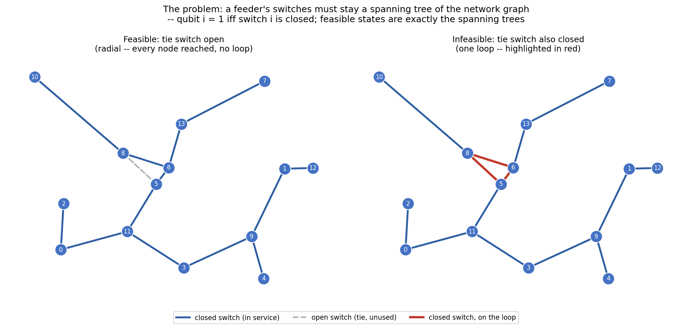

Encoded directly: qubit `i` = 1 iff switch `i` is closed. A configuration
is feasible iff its closed-switch set is a spanning tree of the network
graph — exactly a basis of the network's graphic matroid, shown above on
a small example graph (14 nodes, one candidate tie switch, reused as the
running example in the figures below).

A QAOA mixer's job is to move probability between states without ever
leaving the feasible set. Concretely here, that means one operation
repeated many times: **a basis exchange** — close one switch, open
another, land on a different feasible tree.

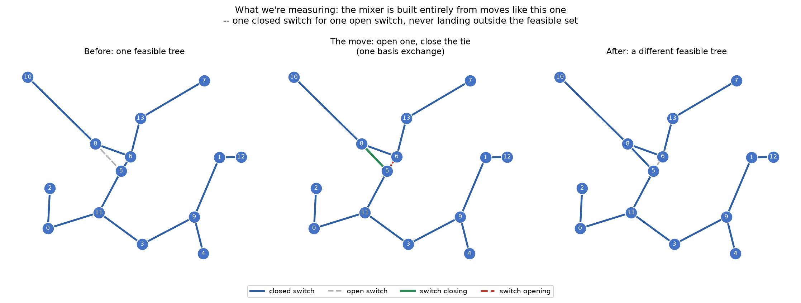

Matroid theory guarantees moves like this, applied one at a time, are
enough to reach any feasible configuration from any other — so the
*entire* mixer is built from a set of these exchanges, one small circuit
term per move. That would be a trivial circuit-design problem if any
switch pair could be exchanged freely — but it can't: closing a switch
without also opening the right one produces a loop, not another tree.
Which switch has to open depends on the rest of the network's *current*
configuration, not just the two switches being touched, so each
exchange's circuit term generally has to be **conditioned** on other
qubits to fire only when the move is actually valid.

The qubits an exchange's term depends on are exactly the *other* tree
edges on its tie switch's **fundamental cycle** — call this set of qubits
the exchange's **witness**. A short cycle means a small witness; a long
one means a large witness, and a large witness means an expensive,
deeply-controlled gate.

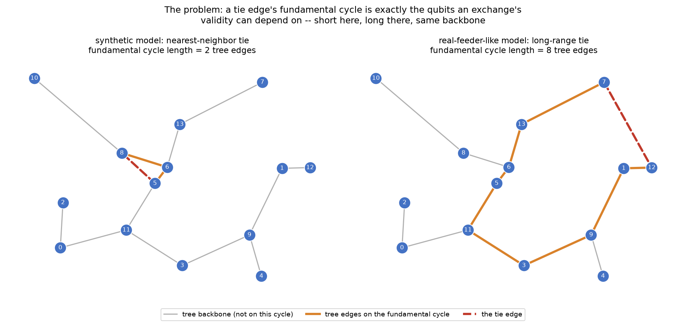

*(synthetic — illustrative, same running example graph, tie switch choice
changed from nearest-neighbor to long-range, `scripts/plot_illustrations.py`)*
2 witness qubits on the left, 8 on the right, in this small example. Real
tie switches are deliberately placed to link *distant* parts of a network
for redundancy — closer to the right panel than the left — which is
exactly what makes this problem harder on real topology than it looks on
a graph where ties happen to be short-range.

**Two more terms used throughout the rest of this document: leakage and
feasible mass.** A term whose witness is the *full* fundamental cycle
fires only on states where its move is genuinely valid — it can never
leave the feasible set. A term whose witness is deliberately capped
smaller than that (technique 2, below) is only *approximately* correct:
on some states it fires when it shouldn't, or the reverse. Each such
mismatch risks **leakage** — probability that ends up on an infeasible
(non-spanning-tree) state after enough exchanges have applied. **Feasible
mass** is the complement, measured per trajectory: start from one
feasible configuration, apply the mixer, and add up how much probability
is still on feasible states afterward — 1.0 means that trajectory leaked
nothing; less than 1.0 means some did. Averaged over many random starting
configurations, this is the **mean feasible mass** reported throughout
this document, measured empirically (`leakage_trace.py` — exact for
small instances, sampled via Wilson's algorithm at scale), not assumed
from a term's abstract witness-search leakage rate alone: a term that
looks leaky in isolation can cost little real mass if the states it
misclassifies are rarely reached in practice, or the reverse.

**This is the actual question this repo measures**: how much does that
conditioning cost, in gates and circuit depth, and does that cost grow or
stay manageable as the network gets larger and as tie placement gets more
realistic? A mixer whose per-move conditioning cost explodes is a mixer
that doesn't scale, independent of anything else about QAOA.

**Why this matters beyond this repo**: keeping that cost bounded is what
would let QAOA run at network sizes where quantum computing could
eventually offer an advantage over classical methods on constrained
problems like this one. Classical formulations of the same radiality
requirement still have to encode it explicitly — as penalty terms in an
objective, or as constraints a solver enforces — while a
constraint-preserving mixer builds feasibility directly into the
algorithm's dynamics instead. That's the promise a bounded-cost result is
a *precondition* for, not proof of — see "What this does and doesn't
demonstrate" below for the boundary between the two.

## Techniques used, and what problem each one solves

Three techniques, building toward the two-tier answer above: techniques
1-2 alone are already enough for a fault-tolerant device; technique 3 —
decomposition, refined to guarantee its own cost — is what makes the
same construction NISQ-ready. In the order they're needed to understand
the results, not the order they were built (the build order — including
two real detours — is in "Headline result 4" of
`docs/scaling-ladder-and-decomposition.md`, kept there as part of the
evidence, not hidden here).

**1. Exact matroid mixer (`mixer.py`, `build_matroid_mixer`).** For each
candidate exchange, brute-force search for the smallest witness that
makes the term's firing rule exactly correct (no leakage outside the
feasible set, verified against the true validity function, not assumed).
Cheap and exact when witnesses stay small — which they do on a synthetic
family where ties are short-range by construction, but not in general:
**tie range** (long fundamental cycles) and, independently, **tie
density** (many ties even at short range) both push true minimal witness
sizes past any practical search cap, on real topology and on a
density-focused synthetic family respectively (`docs/bounded-witness-mixer.md`'s
Finding 1). When that happens, the exact construction doesn't get
gradually more expensive — it gives up on candidates outright
(`dropped_candidates` climbs to 51-95%) and the resulting mixer stops
being fully connected. Full derivation, the real-topology failure's
root-cause trace, and the exact circuit-level construction:
`docs/circuit-validity.md` and `docs/mixer-construction.md`.

**2. Bounded-witness mixer (`truncated_mixer.py`) — bounds *cost*
directly, at a measured, small leakage cost.** When no small *exact*
witness exists, don't drop the candidate exchange: search for a witness
of a fixed, capped size instead, using a **majority-vote** validity rule
over that smaller set of qubits, and accept the resulting leakage —
provided it's measured, not assumed, and stays small. `leakage_trace.py`
traces the actual probability mass this costs on real trajectories
(exactly, not sampled), separately from the abstract leakage rate the
search itself optimizes.

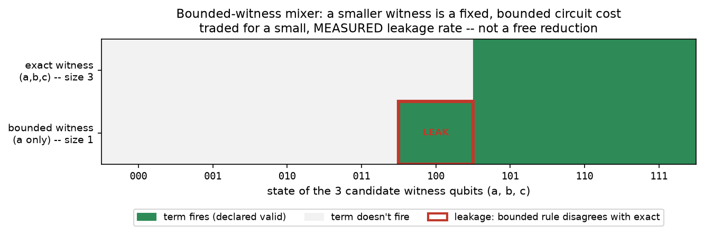

*(concept diagram, not a measurement — a hand-constructed 3-qubit example
chosen to show one clean mismatch, not a real exchange from any graph
elsewhere in this repo)* the exact witness (all 3 qubits) is never wrong;
capping to 1 qubit and taking a majority vote gets the `a=0` group right
unanimously, but state `100` leaks under the `a=1` group's 3-of-4
majority. A wider witness reduces leakage like this but costs more
circuit — which is exactly why this technique cannot be used without its
other half:

**Making that search cost-aware (`cost_alpha`) is not optional.** Picking
witnesses by leakage alone, with no cost penalty, is actively bad: since
adding a witness qubit can only ever weakly *reduce* leakage, an
uncontrolled search has every incentive to walk to the cap every time —
measured at 17,386–32,520 CX gates at just 15-17 qubits, more than a real
37-qubit decomposed feeder circuit. `cost_alpha` adds a cost penalty to
the search objective directly, closing most of that gap, and is this
construction's validated default (`docs/bounded-witness-mixer.md`).

**3a. Zone decomposition (`zone_decomposition.py`) — fixes the *range*
failure structurally and exactly.** Don't build one circuit for the whole network: partition into
zones via a min tie-line-cut, solve each zone's matroid mixer
independently (small qubit count each), plus one small assembly mixer
over the contracted zone graph. Guaranteed **exact** by graphic-matroid
contraction/deletion (the union of every zone's spanning tree plus the
assembly problem's spanning tree is provably a spanning tree of the whole
graph) — a structural fix to the *constraint*, not an approximation. When
the assembly graph is itself still large or dense, the same idea applies
one level up: decompose it too, scaling zone size to its own measured
density instead of a fixed schedule.

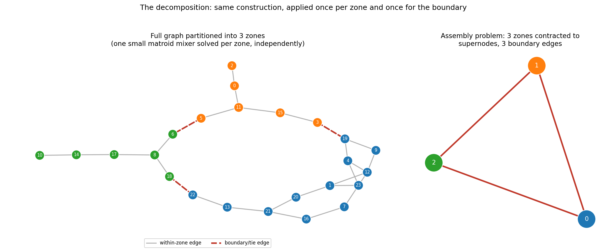

*(synthetic — illustrative example, 24 nodes)* it works specifically
*because* the range failure is local to individual long-range ties: keep
each zone small enough that any tie edge still inside it stays
short-range-like, and push the genuinely long-range connections out to
one small assembly problem instead of forcing the whole graph to absorb
their cost.

**3b. Cost-capped refinement — picking a zone size up front only gets you
*a* cost, not a *controlled* one.** Decomposed cost turns out to have much higher seed-to-seed
variance than whole-graph cost (coefficient of variation up to 99% at
some sizes — decomposition trades one big averaging problem for many
small independent ones, and a single "unlucky" zone can dominate a
seed's total). The fix is the same discipline as technique 2's: measure,
don't guess, applied at every choice point rather than fixed once. Build
each subproblem, transpile it, and check its **actual** cost against a
threshold; if it's already under, sweep `cost_alpha` for the cheapest
passing result instead of accepting the first one that fits; if it's
over, try more than one zone-size granularity and recurse on whichever
gives the cheaper total, rather than committing to a single fixed
schedule and hoping.

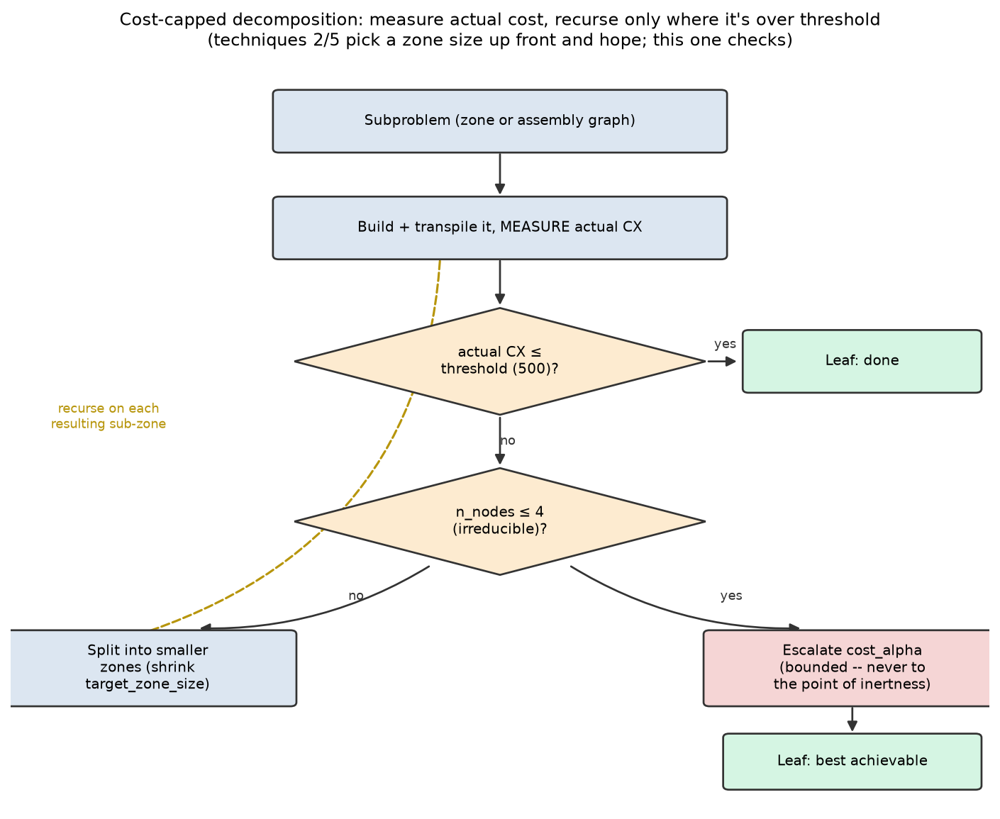

Gets **every seed of the synthetic ladder under 500 CX**, with room to
spare, and the same discipline carries over cleanly to real data
(`docs/scaling-ladder-and-decomposition.md` §8, §11).

## Results: fault-tolerant now, NISQ-ready with decomposition

Recall the two-tier answer from the top: techniques 1-2 — exact, or
cost-aware bounded-witness, applied directly to the whole graph, no
decomposition involved — already form a complete, valid construction:
correct, or controlled-and-measured leakage, at whatever circuit cost the
search finds. A fault-tolerant device has no reason to care about that
cost the way near-term hardware does, so techniques 1-2 alone are the
fault-tolerant-ready answer. Technique 3 — zone decomposition, refined to
guarantee its own cost — exists for a narrower, harder goal on top of
that: making the same construction cheap enough to matter on NISQ
hardware today, against the rough feasibility arithmetic below
(`fidelity ≈ (1-p)^N_CX`, published two-qubit gate error rates):

| CX count | best-case trapped-ion (p=0.001) | typical superconducting (p=0.005) |
|---|---|---|
| 100 | 90% | 61% |
| 500 | 61% | 8% |
| 1,000 | 37% | 0.7% |
| 5,000 | 0.7% | ~0 |
| 13,000 | ~10⁻⁶ | ~0 |

### On synthetic data, the two tiers split cleanly

Technique 2 is stress-tested across an escalating ladder of two things
checked against real data rather than assumed: tie placement (short vs.
long-range — real ties span 33-45% of network diameter, matching the
long-range generator far better than the short-range one) and tie-count
growth (log-scaled, `k_ties(n) ≈ 1.43 ln n` — real and benchmark networks
show the ties-per-bus ratio dropping 6x from 15 to 179 buses, consistent
with log growth — `docs/scaling-ladder-and-decomposition.md` §9). Across
that ladder, technique 2 (whole-graph, no decomposition) plateaus by
`n_nodes=60` and stays fully connected throughout (§2) — a complete
fault-tolerant-ready construction on its own, but, as the table above
already shows, well past a comfortable NISQ regime at these sizes.
Technique 3 fixes that without exception on this data — at every size
≥ 30 nodes, every seed, both conditions, zone decomposition (3a) alone
already costs less than the whole-graph construction (5.6x-46.7x
cheaper), and its cost-capped refinement (3b) guarantees the rest of the
way: every seed, every condition, every size tested, lands under 500 CX
(§6-8):

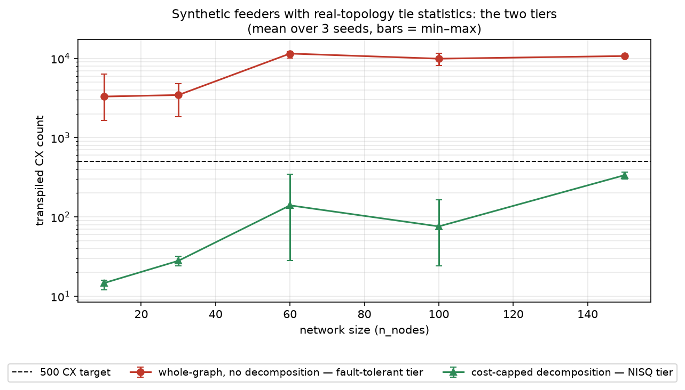

*(Technique 1, the exact construction, is deliberately absent from this
figure and the one below. Its failure mode is dropping candidates it
can't find a small witness for — checked directly on these same graphs
in `docs/scaling-ladder-and-decomposition.md`, that makes it look
artificially CHEAP here (75 CX, fully disconnected, 43% of candidates
dropped, at `long_log, n_nodes=30` — cheaper than the whole-graph
construction that actually works) and would make it look artificially
PERFECT on the mass plot below (`mean_feasible_mass=1.0`, since a dropped
candidate isn't leaky, it's just absent). It also doesn't scale to
`n_nodes=150` long-range at all — brute-force enumeration is intractable
there, which is exactly why this ladder measures technique 2 instead.)*

The same three stages, measured for safety instead of cost:

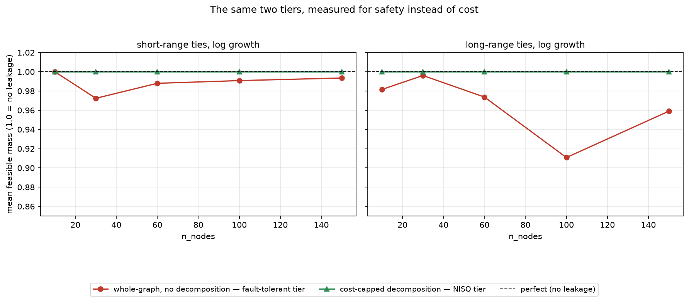

Technique 2 alone leaks real, sometimes substantial probability (down to
91% mean feasible mass on the hardest long-range condition); 3a tightens
that considerably; 3b's cost-capped refinement is indistinguishable from
perfect (1.0 mean feasible mass) at every size, on both conditions —
cheaper AND safer than either stage before it, not a tradeoff between
the two.

At the hardest size tested (`n_nodes=150`), directly against the
feasibility numbers above:

| condition | construction | CX | reading |
|---|---|---|---|
| short-range, log growth | whole-graph | 2,361 | borderline on trapped-ion; not usable on superconducting |
| short-range, log growth | cost-capped | **73** | comfortably NISQ-ready |
| long-range, log growth | whole-graph | 10,825 | not usable on either device |
| long-range, log growth | cost-capped | **337** | comfortably NISQ-ready |

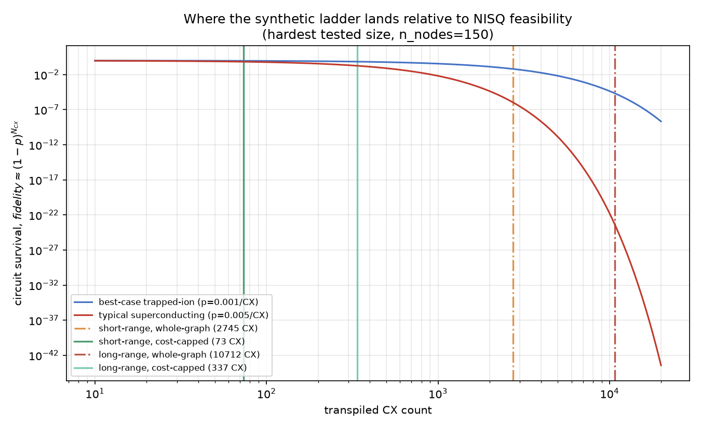

On synthetic data: more decomposition, less cost, no exceptions — and
technique 3b's cost-capped refinement is what actually earns NISQ
feasibility on the harder, long-range condition.

### On real data, the same clean story holds

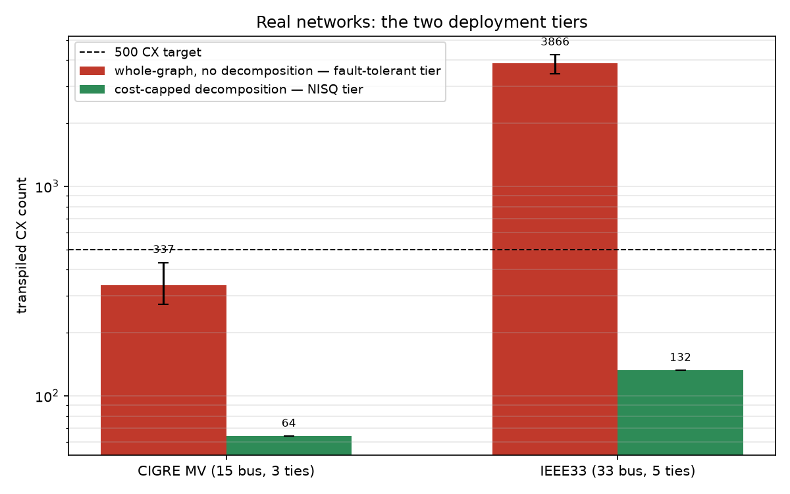

| network | construction | CX | reading |
|---|---|---|---|
| CIGRE MV (15 buses, 3 ties) | exact whole-graph | 12,220 | fault-tolerant-ready; far outside NISQ range |
| CIGRE MV | zone decomposition | 3,668 | cheaper, but still outside a comfortable NISQ regime |
| CIGRE MV | cost-capped refinement | **64** | comfortably NISQ-ready, perfectly safe |
| IEEE33 (33 buses, 5 ties) | exact whole-graph | 96 | 573/597 candidates dropped, disconnected — not usable at any cost |
| IEEE33 | zone decomposition | 132 | already comfortably NISQ-ready |
| IEEE33 | cost-capped refinement | **132** | matches zone decomposition exactly — nothing left on the table |

Same pattern as synthetic data: every stage of technique 3 costs no more
than the one before it, on both networks, no exceptions. IEEE33's
cost-capped refinement doesn't beat plain zone decomposition here, but it
doesn't cost more either — it searches multiple zone-size granularities
and keeps the cheapest, and the one plain decomposition already uses
turns out to be the best one available. Both real networks land
comfortably in NISQ range this way.

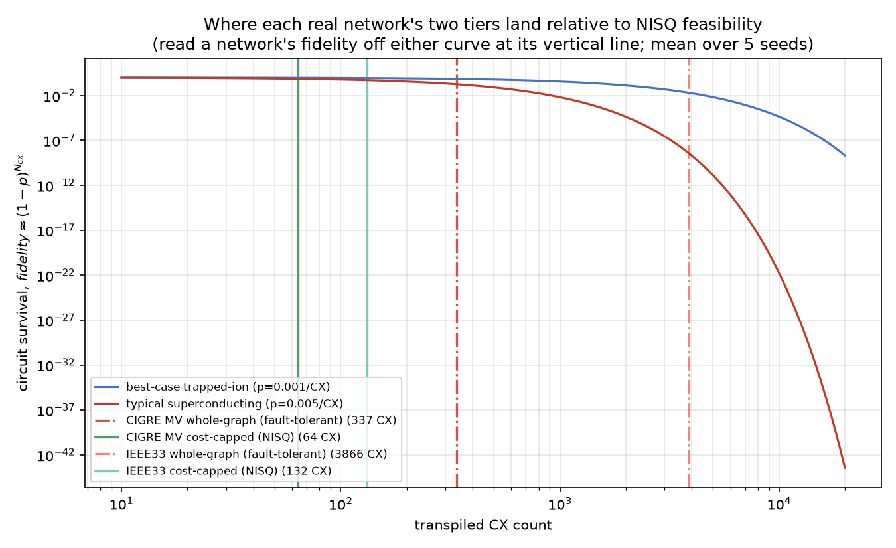

**Full account**: `docs/scaling-ladder-and-decomposition.md`.
`docs/bounded-witness-mixer.md` covers the density-failure axis, the
bounded-witness construction itself, and the cost-aware search in full
detail.

## What this does and doesn't demonstrate

This repo shows the mixer **construction** is correct and scales — both
exactly (fault-tolerant-relevant) and, via decomposition and cost-capping,
cheaply enough for a plausible NISQ target (real-topology-relevant). It
does **not** show a quantum algorithm outperforming a classical baseline:
there is no cost-Hamiltonian/oracle integration, no QAOA execution, no
classical solver comparison, and no test of the iterative boundary
coupling (an ADMM-style loop) this kind of decomposition would need for
the actual optimization objective — only the radiality constraint,
tested here, decomposes exactly. Treat this as evidence the algorithm is
buildable and scalable, a precondition for an advantage claim, not the
claim itself. See `methodology.md` for the precise boundary of what was
measured.

## How to reproduce

Three steps cover everything this README claims:

```
python -m venv .venv
source .venv/bin/activate   # or .venv\Scripts\activate on Windows
pip install -r requirements.txt

python scripts/verify_correctness.py && python scripts/verify_leakage_trace.py
# correctness: the exact construction is exactly leak-free and fully
# connected wherever it applies; the bounded-witness construction's
# leakage tooling (sparse tracer, Wilson's-algorithm sampling) is verified
# against an exact reference.

python scripts/run_real_networks_hierarchical.py
# the real-network numbers the Results section reports: exact vs.
# decomposed vs. cost-capped, both CIGRE MV and IEEE33.

python scripts/plot_results_figures.py && python scripts/plot_illustrations.py
# every figure in this README, regenerated from already-committed data.
```

All scripts are deterministic (fixed random seeds); re-running should
reproduce the committed files in `results/` exactly, modulo `qiskit`/
`networkx` version differences in transpilation.

This reproduces what's *shown* here, not every measurement behind it —
`construction_progression_plot.png`, `synthetic_mass_progression_plot.png`,
and `synthetic_nisq_feasibility_plot.png` all read already-committed CSVs
(`results/cost_aware_scaling_ladder_*.csv`,
`decomposed_cost_aware_ladder_*.csv`, `cost_capped_decomposition_*.csv`)
rather than re-deriving them from scratch. To regenerate those (or dig
into the fuller investigation — the escalating realism ladder, the
density-blowup axis, hierarchical decomposition, the real-topology
growth-model check), the complete set of scripts is listed under
`scripts/` in "Repository layout" below, each tied to the section of
`docs/*.md` it backs.

## Scope

This repo contains the measurement methodology and results for the
question above only — not a production mixer-compilation library, and
not extended to constraint classes other than graphic-matroid radiality
(`methodology.md` has the precise boundary). See "What this does and
doesn't demonstrate" above for the separate, more important boundary:
what a bounded-cost, buildable construction does and doesn't imply about
QAOA performance.

## Repository layout

- `methodology.md` — graph generation, move generation, and exactly what
  "gate count" and "depth" mean.
- `docs/mixer-construction.md` — technical reference: matroid theory,
  exact circuit derivation, correctness-verification arguments.
- `docs/circuit-validity.md` — the real-topology failure, its root cause,
  the decomposition fix, and its scaling validation.
- `docs/bounded-witness-mixer.md` — the density-driven witness-blowup
  axis, the bounded-witness mixer, and the circuit-cost investigation
  behind `cost_alpha`.
- `docs/scaling-ladder-and-decomposition.md` — the escalating realism
  ladder, NISQ feasibility, hierarchical and cost-capped decomposition,
  and direct validation on two real networks. The fullest, most detailed
  account in this repo — everything summarized in this README's Results
  section traces back to a section here.
- `scripts/` — each script's own docstring explains what it measures and
  why; the `docs/*.md` file above covering that topic has the full
  narrative. Grouped by what they validate:
  - **Exact construction**: `graphs.py`, `mixer.py`, `measure.py`,
    `run_scaling_study.py`, `plot.py`, `verify_correctness.py`.
  - **Real topology & decomposition**: `real_feeders.py`,
    `run_real_feeder_validation.py`, `investigate_fundamental_cycles.py`,
    `zone_decomposition.py`, `run_zone_decomposition_validation.py`,
    `run_decomposition_scaling_study.py`.
  - **Bounded-witness mixer**: `random_trees.py`, `truncated_mixer.py`,
    `leakage_trace.py`, `verify_leakage_trace.py`, `tie_density_sweep.py`,
    `run_bounded_witness_safety_survey.py`, `measure_truncated_mixer.py`,
    `truncated_witness_cap_sweep.py`, `truncated_witness_cap_sweep_longrange.py`,
    `truncated_mixer_search_refinement.py`.
  - **Escalating ladder & decomposition**: `run_scaling_study_log_ties.py`,
    `run_cost_aware_scaling_ladder.py`, `run_cost_aware_scaling_ladder_aggressive.py`,
    `run_fixed_alpha_ladder.py`, `run_decomposed_cost_aware_ladder.py`,
    `run_best_of_both_ladder.py`, `run_hierarchical_decomposed_ladder.py`,
    `run_cost_capped_decomposition.py`, `run_real_networks_hierarchical.py`,
    `exact_construction_ladder_check.py`.
  - **Figures**: `plot_illustrations.py` (explanatory diagrams, not
    measurements), `plot_results_figures.py` (this README's five result
    figures, from already-committed CSVs, no re-measurement).
- `results/` — one CSV/plot pair per script above, all generated, none
  hand-edited. `*_before_minimization.*` files are pre-fix numbers, kept
  for the before/after comparison in `docs/circuit-validity.md`.
  `illustration_*.png` are explanatory diagrams, not measurements.

## License

Apache License 2.0 — see `LICENSE`.
